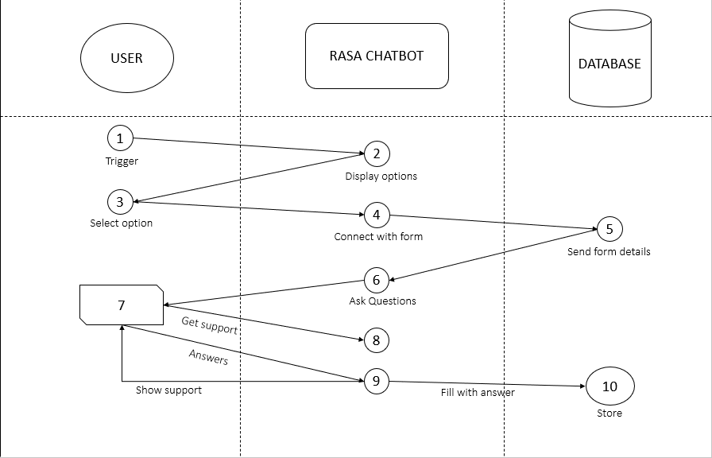

# 2022_IBM_Code_Challenge_FormBee

<h1> Problem Statement</h1>

    Digitization of government services directly leads to a significant increase in quantity of digital data and data entry tasks, especially considering current situations. the average layman finds it difficult to manage and fill the various forms and surveys of the government. even tech-savvy people may find it difficult to fill a form instantaneously and may resort to googling for jargons which wastes time.

<h1>Personas of the system</h1>

    Consider a normal citizen , they can interact with this chatbot to fill government forms they don't have to go anywhere else.

<h5> Usecases</h5>
<ol>   
    <li> Form filling </li>
    <li> printing and exporting filled forms</li>
    <li>viewing and managing forms</li>  
   </ol>
  

<h1>Architecture</h1>
</img>

<h1>Technical stack</h1>
<h5>Frontend</h5>
<ol>
    <li>Bootstrap : Landing page creation</li>
    <li>React Webapp : Chatroom creation</li>
    </ol>
    
<h5>Middlewarre</h5>
<ol>
    <li>Rasa : For chatbot creation </li>
</ol>

<h5>Backend </h5>
<ol>
    <li> Nodejs with Firebase as storage</li>
    </ol>
  

<h1>Video</h1>
<iframe width="560" height="315" src="" frameborder="0" allowfullscreen></iframe>
      </iframe>

<h1>List of Contributors</h1>
<ol>
  <li>Adharsh S</li>
  <li>Allen B Abraham</li>
  <li>Dennis Thomas</li>
  <li>Jeril Monzi Jacob</li>
</ol>

<h1>License &amp acknowledgement</h1>

    GNU 
    

    We would like to thank our mentors Manoj Jain and Ayush Utkarsh for helping us throughout this hackathon.They have helped us to clear our doubts reagrding the stacks in which we worked.Once again thanking their guidance in this hackathon.
    

    
